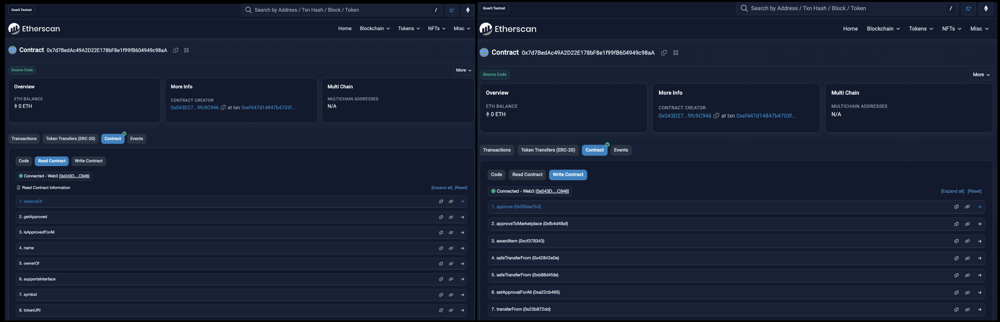
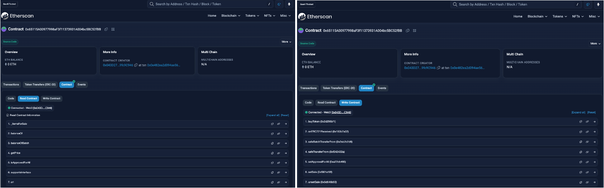

### DESPLIEGUE DE CONTRATO


### MemoriaUrbanaToken : 0x7d7BedAc49A2D22E178bF8e1f99fB604949c98aA
* El contrato crea un token ERC721 llamado MemT (MUT). El contrato puede ser utilizado para crear nuevos tokens, aprobar la custodia del NFT a un contrato que permita custodiar el NFT y comercializarlo.


### MarketPlace : 0x65115A00977998aF3f11373931A004bc5BC52fBB

* Corresponde a un MarketPlace que permite a los usuarios comprar y vender tokens ERC721. En resumen permite comprar y vender tokens ERC721.

```
truffle migrate --network ethereum_goerli_testnet
```


### Verificación de Contrato
truffle run verify  **NOMBRE_CONTRATO**@**ADDRESS_CONTRATO** --network ethereum_goerli_testnet
```
truffle run verify  MemoriaUrbanaToken@0x7d7BedAc49A2D22E178bF8e1f99fB604949c98aA  --network ethereum_goerli_testnet
truffle run verify  MarketPlace@0x65115A00977998aF3f11373931A004bc5BC52fBB   --network ethereum_goerli_testnet
```


### REQUISITOS
En este Sprint, desarrollaremos una primera versión básica de DApp para el caso de uso planteado en el sprint anterior, o una versión simplificada del mismo. Al menos, se realizará:

#[OK]
Una primera versión de Smart Contract (capa lógica). El Smart Contract será compilado y desplegado en una red de desarrollo (Truffle network) o testnet pública (ej. Goerli). 
    * **MemoriaUrbanaToken : 0x7d7BedAc49A2D22E178bF8e1f99fB604949c98aA **



    * **MarketPlace : 0x65115A00977998aF3f11373931A004bc5BC52fBB **



#[OK]
Una versión sencilla de Interfaz visual (capa cliente), que mostrará información de contexto del usuario 
    * **Network connected : 5**
    * **Wallet Address : **


#[OK]
y contendrá un botón para obtener información del Smart Contract y 
* **Nombre NFTs: MemoriaUrbanaToken**
* **Simbolo NFTs: MUT**


#[OK]
otro botón para realizar una escritura en el Smart Contract.

#[OK]
Configuración de proveedor Web3 (capa de conexión) a través de MetaMask, que permitirá la comunicación de la interfaz visual con el Smart Contract / red seleccionada.


#[WIP]
Posibles preguntas para resolver:

¿Cuál es la finalidad / propósito de la DApp? 

¿Qué variables y funciones contiene el Smart Contract? 

¿Qué librería has implementado para la capa de conexión: Web3.js o Ethers.js? ¿Por qué?


Objetivo de la actividad: Entender de forma práctica como es el desarrollo de una aplicación descentralizada (DApp) aplicada a un posible caso de uso real.

