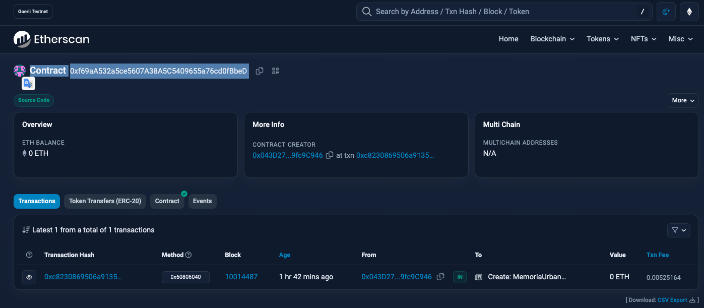
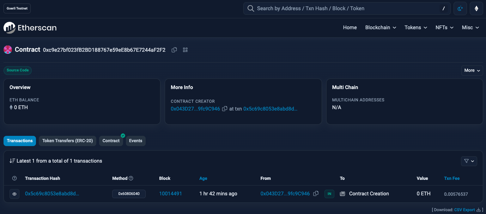
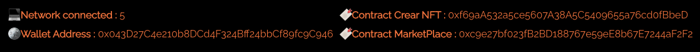
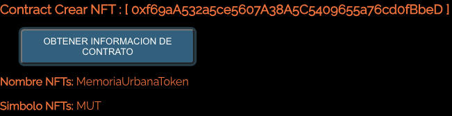

### DESPLIEGUE DE CONTRATO

truffle migrate --network ethereum_goerli_testnet

Auction :  0xC6e78C1B9Ca1735d4e1d68be0d46D219d9429E14
MemoriaUrbanaToken :  0x77c694dD980cD5dDc99Aa7ab2fEE47dc39200e22
MarketPlace :  0x22202084c83d57990B5072A8BD95FAba7CB9E376

### VERIFICACION DE CONTRATO
truffle run verify 
 **NOMBRE_CONTRATO**@**ADDRESS_CONTRATO**
 --network ethereum_goerli_testnet

### VERIFICACION DE CONTRATO

truffle run verify  Auction@0xC6e78C1B9Ca1735d4e1d68be0d46D219d9429E14  --network ethereum_goerli_testnet

truffle run verify  MemoriaUrbanaToken@0x77c694dD980cD5dDc99Aa7ab2fEE47dc39200e22  --network ethereum_goerli_testnet

truffle run verify  MarketPlace@0x22202084c83d57990B5072A8BD95FAba7CB9E376  --network ethereum_goerli_testnet

### VERIFICACION DE CONTRATO
En este Sprint, desarrollaremos una primera versión básica de DApp para el caso de uso planteado en el sprint anterior, o una versión simplificada del mismo. Al menos, se realizará:

#[OK]
Una primera versión de Smart Contract (capa lógica). El Smart Contract será compilado y desplegado en una red de desarrollo (Truffle network) o testnet pública (ej. Goerli). 
    * **MemoriaUrbanaToken : 0xf69aA532a5ce5607A38A5C5409655a76cd0fBbeD**
    
    * **MarketPlace : 0xc9e27bf023fB2BD188767e59eE8b67E7244aF2F2**
    

#[OK]
Una versión sencilla de Interfaz visual (capa cliente), que mostrará información de contexto del usuario 
    * **Network connected : 5**
    * **Wallet Address : 0x043D27C4e210b8DCd4F324Bff24bbCf89fc9**

#[OK]
y contendrá un botón para obtener información del Smart Contract y 
* **Nombre NFTs: MemoriaUrbanaToken**
* **Simbolo NFTs: MUT**

#[WIP]
otro botón para realizar una escritura en el Smart Contract.

#[WIP]
Configuración de proveedor Web3 (capa de conexión) a través de MetaMask, que permitirá la comunicación de la interfaz visual con el Smart Contract / red seleccionada.

#[WIP]
Posibles preguntas para resolver:

¿Cuál es la finalidad / propósito de la DApp? 

¿Qué variables y funciones contiene el Smart Contract? 

¿Qué librería has implementado para la capa de conexión: Web3.js o Ethers.js? ¿Por qué?

Objetivo de la actividad: Entender de forma práctica como es el desarrollo de una aplicación descentralizada (DApp) aplicada a un posible caso de uso real.

